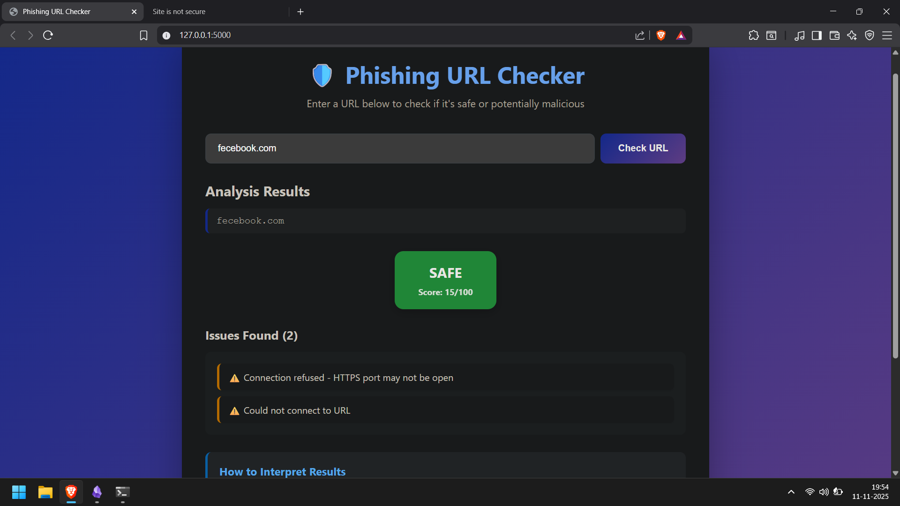
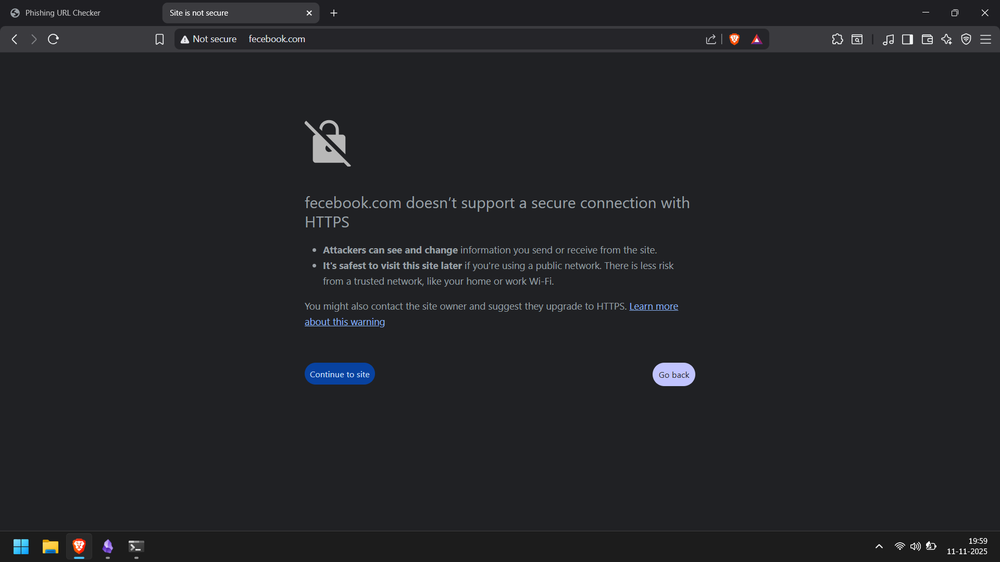
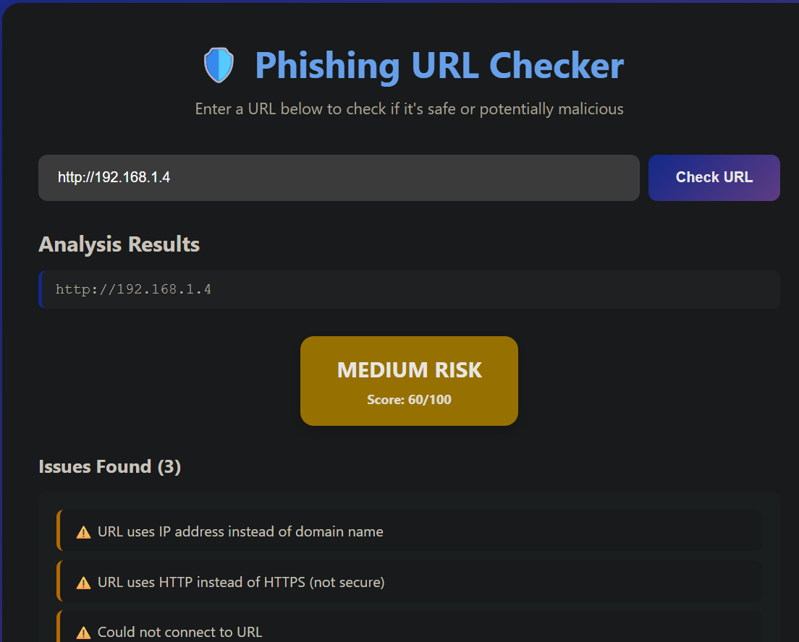
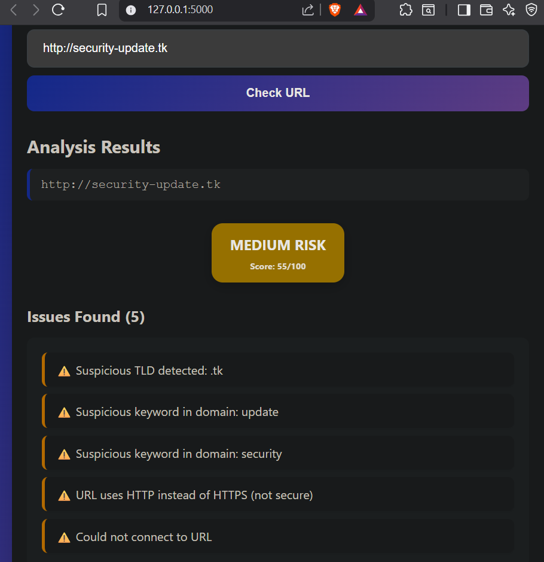
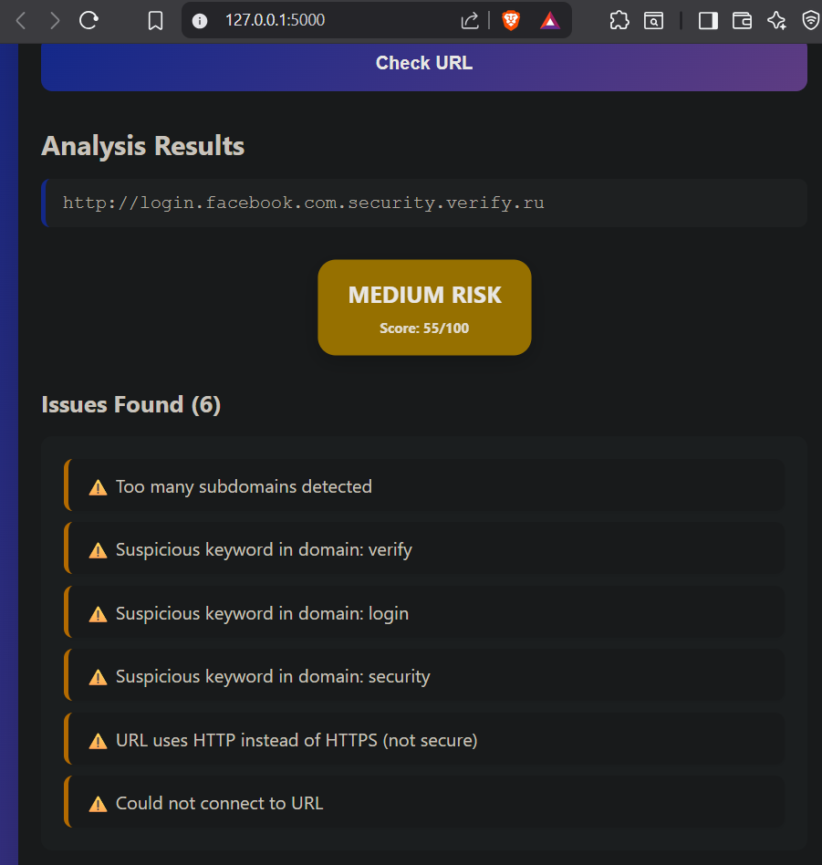
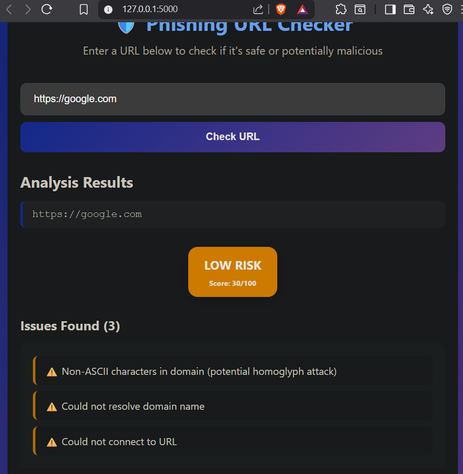
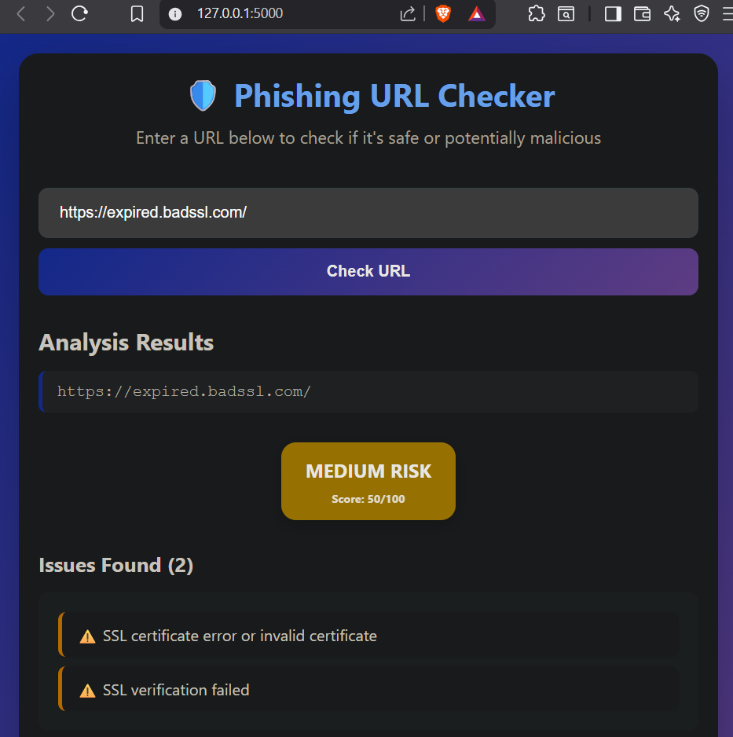
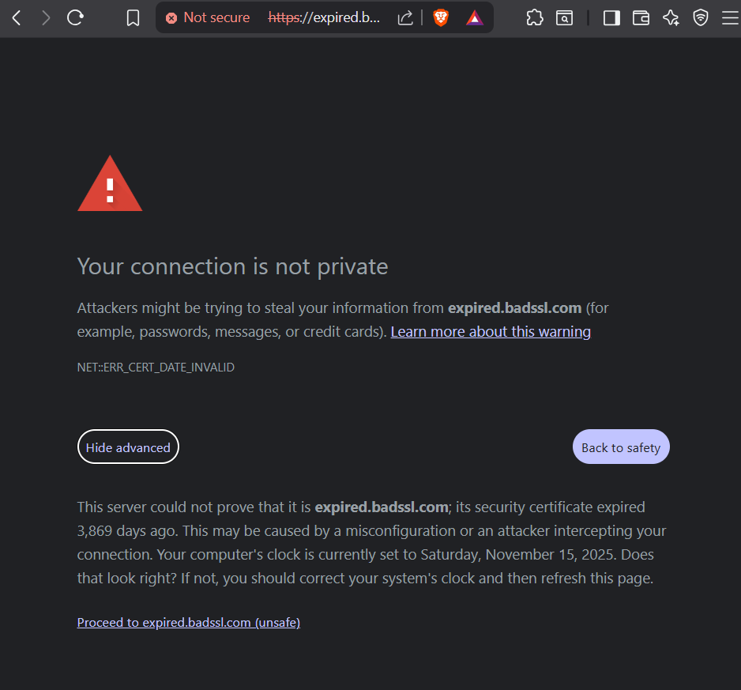
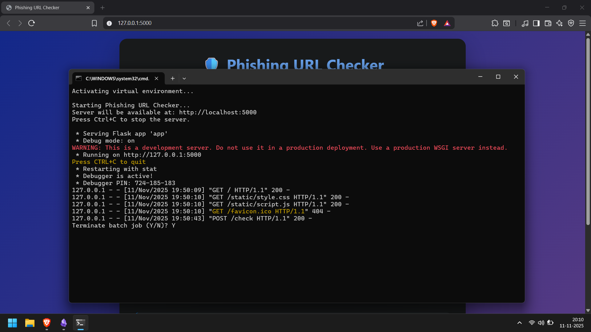

go to the given URL(http://localhost:5000) and enter a domain to analysis
 I checked for "fecebook.com" results was that site does not support HTTPS and when i checked manually it indeed doesn't support HTTPS
Test using IP address 
TLDS Triggers 
Most Obvious phishing URL 
Test for Different style letters 
Exprid SSL 
Press Ctrl+C to Terminate the Job

